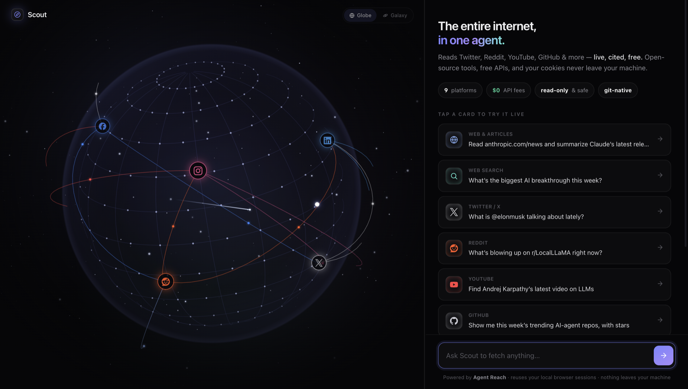

# 🧭 Scout

**The entire internet, in one agent — live, cited, and free.**

Scout is a governed, git-native AI agent that reads **Twitter/X, Reddit, YouTube,
GitHub, LinkedIn, Facebook, Instagram, Exa web search, and any web page** — by
reusing the sessions already in *your* browser. No API fees, no cloud cookie
storage, nothing leaves your machine.

It ships with a self-contained web UI (a reactive 3D globe + galaxy view and a
streaming chat) so anyone who forks it gets a working experience out of the box.



> Scout is a port of **[Agent Reach](https://github.com/Panniantong/Agent-Reach)**
> into the **GitAgent** format, run by the **[GitClaw](https://www.npmjs.com/package/gitclaw)**
> runtime — wrapped in governance (read-only by default), an audit trail (git),
> and a one-fork-to-run UI.

---

## Why Scout

| | Raw Agent Reach | **Scout** |
|---|---|---|
| Reach (9 platforms) | ✅ free | ✅ same free reach |
| **Web UI** (globe + chat) | ❌ | ✅ ships in the repo |
| **Governance** (read-only guard) | ❌ | ✅ enforced by a hook |
| **Audit trail** (`git log`) | ❌ | ✅ |
| **Forkable blueprint** | ❌ | ✅ one command to run |

**Router, not a wrapper.** Scout picks the best local tool for each platform and
calls it directly — it never proxies or re-implements fetching.

---

## What it can read (9 platforms)

| Platform | Backend | Needs a login? |
|---|---|---|
| Any web page / article | Jina Reader | **No** |
| Web search / latest news | Exa (`mcporter`) | **No** |
| YouTube | `yt-dlp` | **No** |
| GitHub | `gh` | **No** (public) |
| LinkedIn (public pages) | Jina Reader | **No** |
| Twitter / X | `twitter-cli` | Be logged into X in your browser |
| Reddit | OpenCLI | Be logged into Reddit + OpenCLI |
| Facebook | OpenCLI | Be logged into Facebook + OpenCLI |
| Instagram | OpenCLI | Be logged into Instagram + OpenCLI |

**4 platforms work with zero login** (Web, Search, YouTube, GitHub). The rest
reuse the sessions you already have — Scout never asks for your passwords and
never uploads a cookie.

---

## Quick start

```bash
git clone https://github.com/suyash-lyzr/scout-agent
cd scout-agent

./setup.sh                 # installs gitclaw, checks tools, creates .env

# add ONE key to .env:
#   ANTHROPIC_API_KEY=...   (preferred)   or   OPENAI_API_KEY=...

node ui/server.js          # → http://localhost:4545
```

That's it. With just a model key, the **4 zero-config platforms work
immediately**. Add the optional tools below to unlock the rest.

### Prerequisites

- **Node.js 18+** — runs GitClaw and the UI server.
- **A model API key** — Anthropic (preferred) or OpenAI, in `.env`.
- **[GitClaw](https://www.npmjs.com/package/gitclaw)** — `setup.sh` installs it
  (`npm install -g gitclaw`).
- **Fetch tools** — `setup.sh` reports which are present:
  - Zero-config: `gh`, `yt-dlp`, `mcporter` (+ Exa backend), `curl`.
  - Optional (session-backed): `twitter-cli`, `opencli`.

---

## Session-backed platforms (optional)

These reuse your **existing** browser logins — you don't create new accounts.

- **Twitter / X** — install [`twitter-cli`](https://pypi.org/project/twitter-cli/),
  and be logged into X in your browser. Scout reads whatever account is active;
  pin a specific one with `TWITTER_BROWSER` / `TWITTER_CHROME_PROFILE` in `.env`.
- **Reddit / Facebook / Instagram** — install **OpenCLI** (a small Chrome
  extension + local CLI) and be logged into those sites. One extension unlocks
  all three.

The fastest way to install everything at once is **Agent Reach's** installer
(`pip install agent-reach` → `agent-reach install`), which sets up `yt-dlp`,
`gh`, `mcporter`/Exa, `twitter-cli`, and OpenCLI for you. Scout then calls those
tools directly.

---

## Using Scout

**Web UI** (recommended):
```bash
node ui/server.js          # http://localhost:4545
```
A streaming chat with a reactive globe/galaxy that focuses the platform being
fetched. Try a card, or ask anything: *"what is @elonmusk talking about lately?"*,
*"what's blowing up on r/LocalLLaMA?"*, *"summarize anthropic.com/news"*.

**CLI:**
```bash
gitclaw --dir . "find this week's trending AI-agent repos on GitHub"
gitclaw --dir .            # interactive
```

---

## Read-only by default (enforced)

Scout **reads**; it never posts, likes, follows, or deletes. The
`hooks/scripts/read-only-guard.sh` hook runs on every tool call and hard-blocks
any write action — unless an operator explicitly sets `SCOUT_ALLOW_WRITES=1` and
confirms. Governance isn't a doc here; it's a hook.

Every fetch is committed to `memory/` — so `git log` is your audit trail.

---

## Structure

```
scout-agent/
├── agent.yaml            # manifest + compliance config
├── SOUL.md               # identity: the router
├── RULES.md              # hard boundaries (read-only, privacy, honesty)
├── skills/scout/         # the routing brain (9 platforms) + backend refs
├── hooks/                # read-only guard + session init
├── memory/               # git-committed audit trail
├── ui/                   # self-contained streaming UI (server.js + index.html)
├── setup.sh              # one-command setup
└── .env.example          # copy to .env, add one key
```

## Fork it

```bash
git clone https://github.com/suyash-lyzr/scout-agent my-research-agent
cd my-research-agent
# edit SOUL.md / RULES.md, add your own skills — you now have a governed,
# internet-capable agent tailored to your team.
```

---

## Credits

- **[Agent Reach](https://github.com/Panniantong/Agent-Reach)** — the upstream
  capability router Scout ports. All the free reach comes from here.
- **[GitClaw](https://www.npmjs.com/package/gitclaw)** — the GitAgent runtime.
- Upstream tools: `yt-dlp`, `gh`, Jina Reader, Exa, `twitter-cli`, OpenCLI.

MIT · a port of Agent Reach · built on GitAgent / GitClaw.
